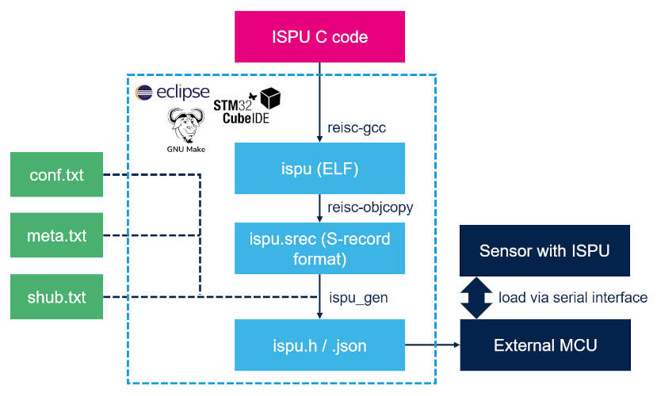

# Examples

This folder contains template and example projects as well as libraries for MEMS devices embedding the ISPU (intelligent sensor processing unit).

Each project can be built using the command line (make) or any Eclipse-based IDE, including STM32CubeIDE, provided that the ISPU plugins are installed.

Prebuilt files containing the ready-to-use device configuration are available in the *output* folder of each example project. For the examples related to STMicroelectronics libraries, the library in binary format is also available to be integrated in other projects based on user needs.

## Build and deploy flow

The figure below illustrates the flow to build and deploy a program on the ISPU. The steps in light blue, which make up the build process, are automatically performed by make or by the Eclipse-based IDE, but are here explained for clarity of the process.



1. The first step is to write the C code to implement the desired algorithms and data processing to run on the ISPU.
2. The C code is then compiled and linked using `reisc-gcc` to obtain the program in a binary format (ELF).
3. The program is then converted to the SREC format, which is needed for the next step, using `reisc-objcopy`.
4. The program is then input to the `ispu_gen` tool to generate both a JSON file and a C header file. These files are equivalent and contain the sequence of write operations required to load the program from the device serial interface. Optionally, additional files (*conf.txt*, *meta.txt*, and *shub.txt*) can be specified as input to the `ispu_gen` tool to add sensor configuration, sensor hub configuration, and metadata to the output files.
5. The files obtained at the previous step can then be used by the firmware of an external MCU to load the ISPU program via the serial interface normally used to communicate with the sensor. The JSON file can be used to load a program at runtime (for example, using [MEMS Studio](https://www.st.com/en/development-tools/mems-studio.html), which allows to quicky evaluate the solution), while the C header file can be used to embed it in the MCU firmware at build time.

For how to write the C code and the other input files, please refer to the template for the device of interest and its readme file. For how to setup your development environment and build a project with the command line or an Eclipse-based IDE, continue reading this readme file.

## Command line

In order to build a project using the command line, the ISPU toolchain must be installed on the system. Besides the toolchain, the `make` build tool must be installed.

The toolchain can be downloaded for Windows, Linux and macOS at the following link: [https://www.st.com/content/st_com/en/products/development-tools/software-development-tools/sensor-software-development-tools/ispu-toolchain.html](https://www.st.com/content/st_com/en/products/development-tools/software-development-tools/sensor-software-development-tools/ispu-toolchain.html).

The toolchain must be extracted from the downloaded archive to any folder on the system. The *bin* folder inside the installed toolchain must be added to the PATH environment variable as follows:

* On Windows:

  * Open the Start search, type "env" and choose "Edit environment variables for your account".
  * Under the "User variables" section, find the row with "Path" in the "Variable" column, select it and click "Edit...".
  * Click on the "New" button to add a new entry.
  * Click on the "Browse..." button, browse to the folder where the toolchain is installed, select the *bin* folder and click "OK".
  * Close all remaining windows by clicking "OK".
  * Open a new terminal. The toolchain is now available to be called from the command line (for example, the *reisc-gcc* command should be found if the user tries to run it).

* On Linux and macOS:

  * Add to your ".bashrc" or equivalent shell startup file the following line:

    ```shell
    export PATH=$PATH":/path/to/toolchain/bin"
    ```

  * Open a new terminal. The toolchain is now available to be called from the command line (for example, the *reisc-gcc* command should be found if the user tries to run it).

Once the toolchain is installed, in order to build a project, the user must enter the *ispu/make* directory inside the project and run `make`.

Note that on macOS an error like the following may be returned when first trying to use the toolchain:

```shell
Library not loaded: /usr/local/opt/gettext/lib/libintl.8.dylib
```

In this case, the "gettext" package must be installed to obtain the missing library. If using an Intel-based Mac (x86_64 architecture), install [Homebrew](https://brew.sh):

```shell
/bin/bash -c "$(curl -fsSL https://raw.githubusercontent.com/Homebrew/install/HEAD/install.sh)"
```

and then use the following command to install the "gettext" package:

```shell
brew install gettext
```

If using an Apple silicon-based Mac (ARM architecture), the x86_64 version of the "gettext" package must be installed. Install [Homebrew](https://brew.sh) for x86_64:

```shell
arch -x86_64 zsh
/bin/bash -c "$(curl -fsSL https://raw.githubusercontent.com/Homebrew/install/HEAD/install.sh)"
```

and then use the following command to install the "gettext" package for x86_64:

```shell
arch -x86_64 /usr/local/bin/brew install gettext
```

After a correct installation of the "gettext" package, the error will disappear and the toolchain will be usable to build ISPU projects.

## Eclipse

In order to build a project using an Eclipse-based IDE, the ISPU plugins must be installed in the IDE that the user desires to use.

If an Eclipse-based IDE is not already available, please download and install the "Eclipse IDE for Embedded C/C++ Developers" from [https://www.eclipse.org](https://www.eclipse.org).

In order to install the plugins, from the main menu, go to "Help", click on "Install New Software...", click on "Add...", insert the URL corresponding to the operating system used in the "Location" field and click the "Add" button. Then, select all the items, click on the "Next" button, accept the license terms, and click on the "Finish" button. When prompted, restart the IDE to complete the installation.

The URL to use is:

* On Windows: [https://sw-center.st.com/mems/ispu/ispu_repository_win](https://sw-center.st.com/mems/ispu/ispu_repository_win)
* On Linux: [https://sw-center.st.com/mems/ispu/ispu_repository_linux](https://sw-center.st.com/mems/ispu/ispu_repository_linux)
* On macOS: [https://sw-center.st.com/mems/ispu/ispu_repository_mac](https://sw-center.st.com/mems/ispu/ispu_repository_mac)

Once the plugins are installed, in order to build a project, the user must go to "File", click on "Import...". Under "General", select "Existing Project into Workspace", click on the "Next" button, click on the "Browse" button, select the folder containing the project (*ispu/eclipse* directory), make sure that the "Copy projects into workspace" is **not** selected (otherwise Eclipse will not be able to locate the source files), and click on the "Finish" button. The project is now imported and can be built.

------

**More information: [http://www.st.com](http://st.com/MEMS)**

**Copyright © 2022 STMicroelectronics**
