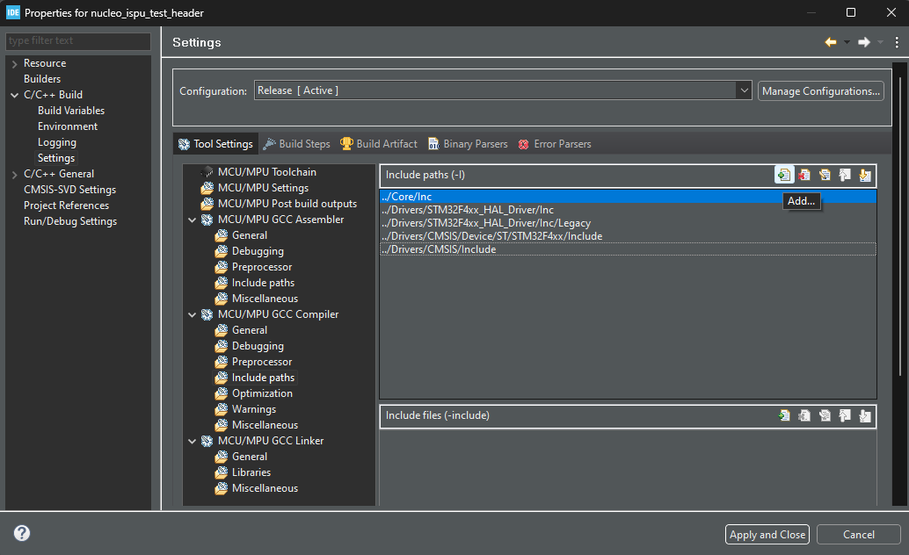
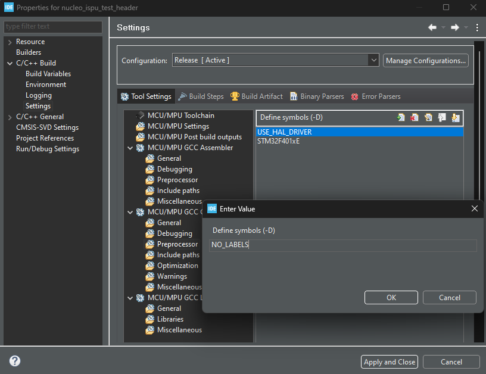

# Test firmware using ISPU C header file

This firmware allows testing any ISPU program, provided that the metadata describing the ISPU outputs is provided. The metadata is used to automatically parse the ISPU outputs based on their type, length, and position in the output registers, and correctly print their values on the UART interface.

Besides the ISPU outputs, the firmware can also be configured to provide execution time measurements for the ISPU code, with istantaneous, minimum, maximum, and average values. 

## Supported hardware and how to configure it

The firmware supports the combination of the following hardware:
 - Nucleo board: [NUCLEO-F401RE](https://www.st.com/en/evaluation-tools/nucleo-f401re.html), [NUCLEO-U575ZI-Q](https://www.st.com/en/evaluation-tools/nucleo-u575zi-q.html)
 - Expansion board: [X-NUCLEO-IKS01A3](https://www.st.com/en/ecosystems/x-nucleo-iks01a3.html), [X-NUCLEO-IKS02A1](https://www.st.com/en/ecosystems/x-nucleo-iks02a1.html), [X-NUCLEO-IKS4A1](https://www.st.com/en/ecosystems/x-nucleo-iks4a1.html)
 - Sensor adapter board (only for X-NUCLEO-IKS01A3 and X-NUCLEO-IKS02A1): [STEVAL-MKI229A](https://www.st.com/en/evaluation-tools/steval-mki229a.html), [STEVAL-MKI230KA](https://www.st.com/en/evaluation-tools/steval-mki230ka.html), [STEVAL-MKI233KA](https://www.st.com/en/evaluation-tools/steval-mki233ka.html)

Regarding the expansion board, make sure that the INT2 pin of the sensor is correctly routed, otherwise the measurement of the execution time will not work:
 - On the X-NUCLEO-IKS01A3, JP6 (*USER_INT* routing selector) must be positioned to connect pins 13 and 14 to route *M_INT2_O*, the INT2 pin of the DIL24 adapter socket
 - On the X-NUCLEO-IKS02A1, JP6 (*USER_INT* routing selector) must be positioned to connect pins 5 and 6  to route *M_INT2_O*, the INT2 pin of the DIL24 adapter socket
 - On the X-NUCLEO-IKS4A1, the on-board LSM6DSO16IS sensor is used and routing the INT2 pin is not dependent on any jumper configuration

If using the X-NUCLEO-IKS4A1, do not plug any sensor adapter board in the DIL24 socket if it hosts a sensor with the same I2C address as the LSM6DSO16IS sensor already available on the expansion board, as a clash of addresses does not allow the firmware to work correctly. If a sensor with the same I2C address must necessarily be plugged in the DIL24 socket, then SB34, SB35, SB43 and SB44 soldering bridges must be modified to connect the SA0 pin of the DIL24 socket to VDD and the SA0 pin of the LSM6DSO16IS sensor of the expansion board to ground, or viceversa, in order to differentiate the I2C addresses.

 Note: make sure that the Nucleo board ST-LINK firmware is updated to the latest version, as it may affect the correct functioning of the communication between the board and the PC. To check the ST-LINK firmware version and upgrade it, you may use the [dedicated upgrade utility](https://www.st.com/en/development-tools/stsw-link007.html) or other ST tools that embed it (for example, [STM32CubeProgrammer](https://www.st.com/en/development-tools/stm32cubeprog.html) or [STM32CubeIDE](https://www.st.com/en/development-tools/stm32cubeide.html)).

## Build and flashing

The firmware project for each supported Nucleo board is available in the corresponding folder. The projects can be built using either the Makefile (with the [Arm GNU Toolchain for bare-metal target](https://developer.arm.com/Tools%20and%20Software/GNU%20Toolchain) and the [ISPU toolchain](https://www.st.com/en/development-tools/ispu-toolchain.html) installed) or the [STM32CubeIDE](https://www.st.com/en/development-tools/stm32cubeide.html) project (with the ISPU plugins installed). The projects can be generated for other development enviroments with [STM32CubeMX](https://www.st.com/en/development-tools/stm32cubemx.html) using the provided *.ioc* files. Note that, after the generation from the *.ioc* file, adjustments to the build process may be needed.

The project code may also be used to port the firmware to a non-supported hardware setup. The firmware was generated using [STM32CubeMX](https://www.st.com/en/development-tools/stm32cubemx.html). All custom code is contained in *Core/Inc/application.h* and *Core/Src/application.c* (the *application* function is called from *Core/Src/main.c* in the main loop), thus allowing for easy porting, without modifying much of *Core/Src/application.c*. Modifications might be necessary for code related to hardware-dependent resources, such as timers, interrupt pins, and communication interfaces.

For how to set up the ISPU development environment (ISPU toolchain or ISPU Eclipse/STM32CubeIDE plugins), you can refer to the README file in the [examples](../../examples/) folder of this repository.

In order to build the firmware with the Makefile, run the following command:

```shell
make ISPU_DIR=<ispu_folder>
```

where `ispu_folder` is the folder containing the ISPU project. This command automatically builds the ISPU project, copies the resulting C header file containing the ISPU program, and uses it to build the Nucleo firmware.

In addition, it is possible to define the `NO_LABELS` macro for the build, with the effect that the ISPU outputs will be printed only in numerical form. Refer to the "Firmware usage" section of this README for more details.

```shell
make ISPU_DIR=<ispu_folder> EXTRA_DEFS=-DNO_LABELS
```

Once the firmware is correctly built, the board can be flashed using the `flash.sh` and `flash.bat` scripts available in the project folder. These scripts require the [STM32CubeProgrammer](https://www.st.com/en/development-tools/stm32cubeprog.html) to be installed, and the *bin* subfolder of its installation folder to be part of the PATH environment variable, in order to make the `STM32_Programmer_CLI` command available. In alternative, the board can be flashed manually using the STM32CubeProgrammer graphical interface, or by simply copying the binary file to the Nucleo board mass storage. The binary file can be found in the *build* folder.

In order to use STM32CubeIDE, the project must be imported: from the main menu, go to "File", "Import...", select "General", "Existing Projects into Workspace", browse for the root directory of the project, and click on "Finish".

The folder containing the ISPU C header file must be added to the "Includes paths" in the project "Properties". After this, the project can be built and flashed via the STM32CubeIDE.



If needed, the `NO_LABELS` macro must be added to the "Define symbols" in the project "Properties".



It is possible to also import and build the ISPU project with STM32CubeIDE. In this case, both projects can be built at the same time: from the main menu, go to "Project" and click on "Build All". The ISPU project must be built first. If that is not the case, from the main menu, go to "Window", "Preferences", browse to "General", "Workspace", "Build", uncheck "Use default build order" and change the "Project build order" as needed.

If the ISPU project is built with STM32CubeIDE, the folder containing the C header file is the *release* subfolder of the *eclipse* folder inside the ISPU project folder.

## Firmware usage

The firmware communicates via UART interface, both to send the ISPU outputs and execution time measurements to the PC, and to receive commands from the PC. Any terminal emulator or programming language with serial communication support can be used, making sure to set the baud rate to the correct value, that is 921600 for this firmware.

By default, the firmware prints the ISPU outputs. For this, the firmware needs the ISPU outputs metadata to be available. This metadata must be specified in the *meta.txt* file of the ISPU project. For details on how write this file, you can refer to the README file of the template for the specific sensor, available in the [examples](../../examples/) folder of this repository. All the ready-to-use examples contained in the [examples](../../examples/) folder already have the metadata correctly defined.

In order to modify what the firmware prints on the UART interface, the following commands must be used:
* *\*res <0|1>*: disables (0) or enables (1) the print of the ISPU outputs
* *\*time  <0|1>*: disables (0) or enables (1) the print of the execution time measurements

The ISPU outputs are read and printed on the UART interface upon receiving an interrupt from the INT1 pin of the sensor (trigger on the rising edge). By default, if the metadata includes mappings between numerical values and labels, the labels corresponding to the output values are displayed between parenthesis, as shown in the example below.

```
Acc x [g]	Acc y [g]	Acc z [g]	Wake-up
0.002928	-0.023424	1.010648	0 (inactive)
0.004880	-0.021960	1.010648	0 (inactive)
0.004392	-0.023912	1.011136	0 (inactive)
```

In case this behavior is undesired, the firmware can be built to omit the labels as described in the "Build and flashing" section of this README. The result is then the following:

```
Acc x [g]	Acc y [g]	Acc z [g]	Wake-up
0.002928	-0.023424	1.010648	0
0.004880	-0.021960	1.010648	0
0.004392	-0.023912	1.011136	0
```

The execution time is measured as the time bewteen a falling edge and the subsequent rising edge of the signal on the INT2 pin of the sensor, and it is printed on the UART interface on the rising edge. For this to work, the sensor must be configured to route the ISPU sleep signal, which stays low while the ISPU is running, to the INT2 pin. This can be achieved by setting the following line in the *conf.txt* file of the ISPU project:

```
ispu_sleep_int2 enable
```

This is already included by default in all examples and templates available in the [examples](../../examples/) folder of this repository. In alternative, it is possible to control the INT2 pin status directly from the ISPU code in order to measure the execution time of a specific portion of code.

The execution time values are printed with the following format and are expressed in microseconds:

\<instantaneous\> \<minimum\> \<maximum\> \<average\>

For example:

```
207	199	511	207.746368
208	199	511	207.746490
208	199	511	207.746613
```

The firmware also offers some commands allowing reading and writing any register of the sensor:
* *\*read <XX>*: reads the register at address *XX*, where the address is expressed in hexadecimal format
* *\*write <XX> <YY>*: writes value *YY* in the register at address *XX*, where both the value and the address are expressed in hexadecimal format
* *\*read_ispu <XX>*: reads the "ISPU interaction" register at address *XX*, where the address is expressed in hexadecimal format
* *\*write_ispu <XX> <YY>*: writes value *YY* in the "ISPU interaction" register at address *XX*, where both the value and the address are expressed in hexadecimal format

------

**More information: [http://www.st.com](http://st.com/MEMS)**

**Copyright © 2025 STMicroelectronics**
