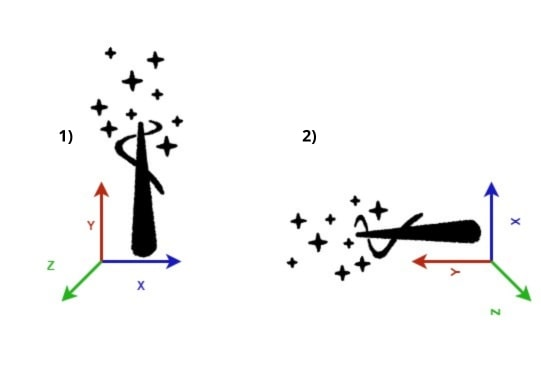

# ISPU wand: air-written letter recognition

This is a complete and fully customizable example of an air-written letter recognition deep-learning model running on the ISPU core embedded in ST's MEMS sensors.

A pretrained model for recognizing the letters I, S, P, and U is available at [models/lsm6dso16is_ISPU_reference_dataset](./models/lsm6dso16is_ISPU_reference_dataset). For details on this model, refer to the dedicated [README](./models/lsm6dso16is_ISPU_reference_dataset/README.md).

New models can be trained, validated, and prepared for deployment with the services exposed as make targets in the *Makefile* of this folder.

## Main directory components

* [datasets](./datasets): placeholder for the air-writing IMU datasets
* [application](./application): code necessary for the deployment of the complete ISPU application
* [models](./models): output files generated and used by the *Makefile* services for each model, including the pretrained model

## Prerequisites

### Hardware setup

This is the minimal hardware setup required to reproduce all the steps for the pretrained model, collect new datalogs, and apply all the available services to a new use case.

- Nucleo board: [Nucleo-F401RE](https://www.st.com/en/evaluation-tools/nucleo-f401re.html) or [Nucleo-U575ZI-Q](https://www.st.com/en/evaluation-tools/nucleo-u575zi-q.html)
- Expansion board: [X-NUCLEO-IKS01A3](https://www.st.com/en/ecosystems/x-nucleo-iks01a3.html), [X-NUCLEO-IKS02A1](https://www.st.com/en/ecosystems/x-nucleo-iks02a1.html) or [X-NUCLEO-IKS4A1](https://www.st.com/en/ecosystems/x-nucleo-iks4a1.html)
- Sensor adapter board (only for X-NUCLEO-IKS01A3 and X-NUCLEO-IKS02A1): [STEVAL-MKI229A](https://www.st.com/en/evaluation-tools/steval-mki229a.html), [STEVAL-MKI230KA](https://www.st.com/en/evaluation-tools/steval-mki230ka.html), [STEVAL-MKI233KA](https://www.st.com/en/evaluation-tools/steval-mki233ka.html)

### Software requirements

- [Python](https://www.python.org), required ≤ 3.11, tested with ≥ 3.9
- Python libraries in [training/requirements.txt](./training/requirements.txt)
- [GNU Make](https://www.gnu.org/software/make)
- [ISPU Toolchain](https://www.st.com/en/development-tools/ispu-toolchain.html)
- [ST Edge AI Core](https://www.st.com/en/development-tools/stedgeai-core.html)
- [Arm GNU Toolchain for bare-metal target (arm-none-eabi)](https://developer.arm.com/Tools%20and%20Software/GNU%20Toolchain)
- [STM32CubeProgrammer](https://www.st.com/en/development-tools/stm32cubeprog.html)

All the tools above must be added to the system PATH. For the ISPU toolchain you can refer to the dedicated [README](https://github.com/STMicroelectronics/ispu-examples/blob/master/README.md) and for ST Edge AI Core, you can refer to the documentation in its installation folder.

- [Nucleo firmware for ISPU validation on target](../../host_firmware/nucleo_ispu_stedgeai_validate)
- [MEMS Studio](https://www.st.com/en/development-tools/mems-studio.html)
- Nucleo custom firmware for MEMS Studio
   - Download the [X-CUBE-ISPU](https://www.st.com/en/embedded-software/x-cube-ispu.html) software package
   - In the *Projects* folder, get the *DataLogExtended* firmware for the specific hardware setup
- [Nucleo firmware for running on ISPU](../../host_firmware/nucleo_ispu_test_header)

## Services

The `.PHONY` targets in the top-level Makefile represent the services that the user can execute.

The different services and the corresponding operations are described in the table below.

| Service           | Operation                                                        |
| ----------------- | ---------------------------------------------------------------- |
| `train`           | Train a model based on the reference dataset or a new dataset    |
| `validate_host`   | Evaluate a model accuracy on a PC                                |
| `validate_target` | Evaluate a model accuracy and benchmark it on the ISPU           |
| `generate`        | Generate a model for deployment on the ISPU                      |
| `run`             | Run a model on the ISPU                                          |

If no argument is specified when executing the services, the files for the pretrained model are used. You can refer to the [Workflow](#workflow) section below and to the training [README](./training/README.md) to know how to retrain the model with your custom data collection, how to measure its performance, and deploy it to the ISPU target.

## Guidelines

The application works as follows:

1. Wait for a **trigger** condition to activate the air-written letter recognition model.
2. Once the **trigger** condition is met, collect a window of signal of a certain length that will be the input to a 1D CNN deep-learning model. The user can check the **trigger** condition by looking at the boolean output field **"go"**, which is set to 1 by the application once the condition is met and kept high until the inference is completed.
3. Once the input window is collected, the recognition model executes the inference and outputs the predicted character as well as the probability of each class (target letters).
4. Once the output is produced, the application waits a certain number of samples, which is a rejection window to avoid unwanted multiple activations.
5. Once the rejection window has expired, the application goes back to its initial state at step 1.

### Gesture segmentation

The recognition model is triggered going from position 1) to position 2). Immediately after the trigger condition is satisfied, the user can perform the gesture while a window of signal of a predefined length is collected. Finally, the air-writing recognition model will classify the input window.

Since the trigger mechanism is application specific, its parameters can be tuned by the user during the training step when building a custom use case. At the end of this step, they will be dumped in a C header file that can be used to deploy the application on the ISPU target. The same parameters are used to segment the data collection to ensure the same behavior between Python scripts and ISPU firmware. More details about the trigger parameters are explained in the training [README](./training/README.md).

## Workflow

In order to train and deploy a new air-written letters recognition example follow these steps:

- Collect the datalogs of air-written letters and put them in the `datasets/data_collection_name` folder with the format described in the datasets [README](./datasets/README.md).
- Navigate with your terminal application to this folder.
- Edit your training configuration in a YAML file as described in the training [README](./training/README.md).
- Launch `make train USER_CONFIG=path/to/user_config.yaml`. A folder named `models/configuration_name` (where `configuration_name` is the *name* field under *general* section in the YAML file) will be created containing the following files:
   - `cnn_8x8x8.h5`: trained model
   - `validation_data.npz`: test dataset that can be used to perform validation with `stedgeai`
   - `ispu_wand_defs.h`: macros to be used by the ISPU code
   - `ispu_wand.json`: json containing the description of the ISPU output format
   - `conf.txt`: device hardware configuration of the sensor and the ISPU

   These files can be used in the following steps by specifying `MODEL_DIR=models/configuration_name` as additional arguments of the service invocation.
- Launch `make validate_host MODEL_DIR=path/to/user_model_dir` to perform the validation on the host with `stedgeai` to verify if there is any issue with the model conversion with `stedgeai`. Ideally, you should get the same accuracy results and X-cross results should confirm the match between the Python equivalent and the converted model.
- Connect and flash the Nucleo board with the firmware for validation on target with ST Edge AI Core. Refer to the firmware [README](../../host_firmware/nucleo_ispu_stedgeai_validate/README.md) for instructions about the board setup and flashing.
- Launch `make validate_target MODEL_DIR=path/to/user_model_dir` to run the validation on the ISPU. This step is crucial to avoid potentially critical issues in the final application, since the validation on the target lets you:
   - Measure the inference time
   - See if there is any out-of-memory issue
- Launch `make generate MODEL_DIR=path/to/user_model_dir`. With this service you generate the files necessary to deploy your use case on the ISPU. In the folder `application/output` of the specified model, you will find the `ispu_wand.json`, useful to test the model with [MEMS Studio](https://www.st.com/en/development-tools/mems-studio.html), and the `ispu_wand.h`, which can be used to integrate the model in a custom host firmware.
- Launch `make run MODEL_DIR=path/to/user_model_dir`. With this service you build the [ISPU test firmware](../../host_firmware/nucleo_ispu_test_header) with the specified model and flash it on the Nucleo board. The Nucleo can then be directly used to test the model. Refer to the firmware [README](../../host_firmware/nucleo_ispu_test_header/README.md) for details on how to use it.

   By default, the firmware for Nucleo-F401RE is used. In order to use a different firmware, add the following parameter to the command: `RUN_FW=path/to/test_firmware`. Additionally, if you have multiple boards connected, you may have to specify the index of the ST-Link probe with `PROBE_INDEX=probe_idx`. Refer to the error message of the flash script for how to get the correct probe index.

------

**More information: [http://www.st.com](http://st.com/MEMS)**

**Copyright © 2024 STMicroelectronics**
