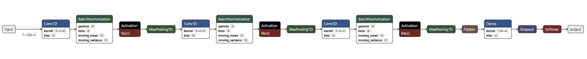
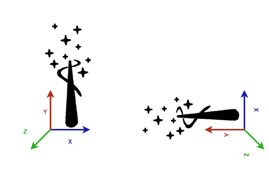

# Overview of the ISPU wand model

This is a model for air writing recognition that detects the letters I, S, P, and U.

The model is a simple and tiny 1D CNN architecture composed of three feature extraction blocks (Conv1D + BatchNorm + MaxPooling) and one simple classification stage (Dense layer + Softmax), that fits perfectly the ISPU characteristic in terms of model size and execution time.

The model was trained on a custom dataset consisting of accelerometer data only, sampled at 52 Hz with 8 g full-scale. The data was collected using a LSM6DSO16IS smart IMU mounted with the orientation shown in the figure below.

