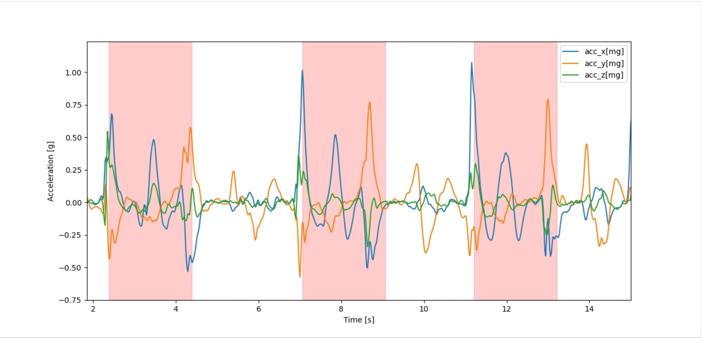

# Training service

The training service can be used to automatically retrain the ISPU wand model
to recognize custom air-written letters.

The service is entirely based on a YAML configuration file that can be specified when executing the training service from the [ispu_wand](..) folder:

```shell
make train USER_CONFIG=path/to/user_config.yaml
```

Users are supposed to have their data collection stored in the format described in the datasets [README](../datasets/README.md) in order to be able to train a new model.

The file `user_config.yaml` in this folder can be followed as a reference example and is the one that can be used for retraining the example use case. It is also the default configuration file used when launching `make train` without any additional argument.

## YAML configuration overview

The YAML configuration file can be seen as a set of key-value pairs expressing the user configuration for the training service. Please, note that every configuration declared as *optional* will be set to its default value in case you do not specify it. The definition *nullable* means that the specific configuration can be set to `null` by the user. Training service configurations are grouped into the following categories:
- `general`:
	- `name`: use case name (mandatory)

- `dataset`:
	- `name`: user data collection name (mandatory)
	- `path`: path to the user data collection (mandatory)

- `preprocessing`:
	- `f_sample`: sensor ODR (mandatory)
	- `full_scale`: sensor full-scale (mandatory)
	- `power_mode`: sensor power mode (optional, default=`high_performance`)
	- `lp_cut`: low-pass cut frequency of the IIR2 Butterworth filter used for signal filtering (optional, nullable, default=`null`)
	- `hp_cut`: high-pass cut frequency of the IIR2 Butterworth filter used for signal filtering (required for the gesture segmentation trigger) (optional, default=`1`)
	- `discard_len_samples`: number of initial samples to be discarded in every log (optional, default=`0`)
	- gesture segmentation configuration parameters described in detail in the [Gesture segmentation](./README.md#gesture-segmentation) section
	- `show_segmentation`: plot logs data with applied segmentation. This configuration can be set to `null` to disable the segmentation monitor, `raw` to inspect the segmented gestures as raw signal or `filtered` to inspect the filtered signal (optional, nullable, default=`null`)

- `training`:
	- `epochs`: number of training epochs (optional, default=`150`)
	- `batch_size`: training batch size (optional, default=`32`)
	- `train_test_split`: percentage of the user dataset to be used as the training set. Number between 0 and 1 (optional, default=`0.8`)
	- `train_validation_split`: percentage of the user training set to be used as the validation set. Number between 0 and 1 (optional, default=`0.1`)
	- `show_stats`: plot training history and confusion matrix (optional, default=`true`)

- `application`:
	- `prediction_threshold`: minimum threshold to trust a gesture prediction. If the predicted letter has probability below this threshold, no output letter will be displayed (optional, default=`0.6`)

## Gesture segmentation

A crucial configuration is the gesture segmentation. This is a trigger mechanism that will be used by the application to trigger the collection of the window of signal that will be input to the 1D CNN model.

The accelerometer signal is filtered with a second order bandpass Butterworth filter (with default cut frequencies of 1 Hz and 5 Hz), to remove low frequencies indicative of the device orientation and high frequency movements.

The gesture segmentation can be defined by this set of user-configurable parameters in the YAML file:
- `win_ths_g`: threshold on the filtered x-axis used to trigger the gesture segmentation
- `trig_len_samples`: number of consecutive samples over threshold `win_ths_g` for the x-axis to trigger the gesture segmentation
- `win_len_samples`: model input window length in number of samples
- `reset_len_samples`: minimum number of consecutive samples between two segmented gestures

By setting the `show_segmentation` parameter to `filtered` or `raw`, the user can inspect the gestures segmented in every log to see if the trigger mechanism is working properly. Then, the number of segmented letters is printed to the standard output to make the user aware of the number of gestures segmented and check if it matches the number of air-written letters collected in the dataset. An example of the gesture segmentation for the letter I from the `lsm6dso16is_ISPU_reference_dataset` dataset is shown in the figure below (using the default user_config.yaml file).



------

**More information: [http://www.st.com](http://st.com/MEMS)**

**Copyright © 2024 STMicroelectronics**
