# How to use the ISPU for anomaly detection with NanoEdge AI Studio

The challenge for designers who want to monitor warning signs of imminent equipment failure is how to build reliable battery-operated sensor nodes for predictive maintenance applications.

The ISPU allows running anomaly detection directly inside the sensor, a major innovation in predictive maintenance for industrial applications that offers significant advantages in system-level power efficiency, downtime reduction, and maintenance costs. Once the anomaly is detected by the ISPU, the sensor can wake up the host processor for further analysis.

NanoEdge AI (NEAI) Studio offers a quick and intuitive approach for building anomaly-detection solutions. This tutorial describes how to use NEAI Studio to build such a solution and test it running on the ISPU embedded in ST's ISM330ISN sensor.

## Before starting, what do you need?

In this tutorial, the following **software** tools and packages are used:
-   [NanoEdge AI Studio](https://www.st.com/en/development-tools/nanoedgeaistudio.html):
    push-button development tool for developers to create machine learning solutions
-   [X-CUBE-ISPU](https://www.st.com/en/embedded-software/x-cube-ispu.html):
    expansion software package for STM32Cube including support for the ISPU
-   [STM32CubeIDE](https://www.st.com/en/development-tools/stm32cubeide.html):
    an advanced C/C++ development platform for STM32 microcontrollers
-   [PuTTY](https://www.putty.org): a client to communicate via serial interface. Any other equivalent software may also be used.

The following **hardware** is also used:
-   [NUCLEO-F401RE](https://www.st.com/en/evaluation-tools/nucleo-f401re.html):
    STM32 Nucleo board supported by the X-CUBE-ISPU package

    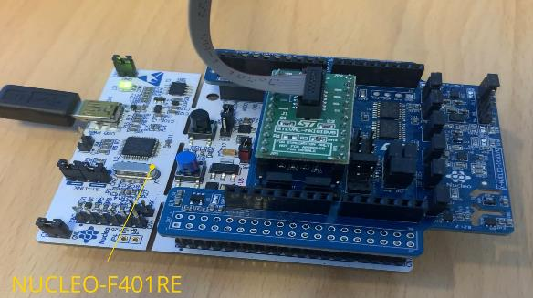

-   [X-NUCLEO-IKS01A3](https://www.st.com/en/ecosystems/x-nucleo-iks01a3.html):
    motion MEMS and environmental sensors evaluation board, which must be plugged onto the NUCLEO-F401RE via the Arduino UNO V3 connector

    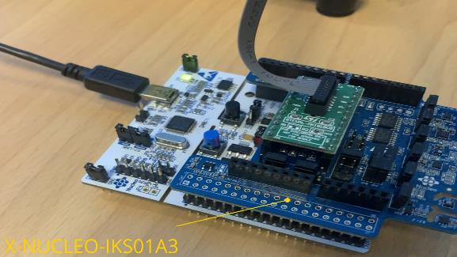

-   [STEVAL-MKI233KA](https://www.st.com/en/evaluation-tools/steval-mki233ka.html):
    evaluation kit consisting of the STEVAL-MKI233A main sensing board, which mounts the ISM330ISNTR 3-axis accelerometer and 3-axis gyroscope with embedded ISPU, the STEVAL-MKIGIBV5 adapter board, and a flat cable for connecting the two. The adapter board must be plugged into the DIL24 socket on the X-NUCLEO-IKS01A3 board.

    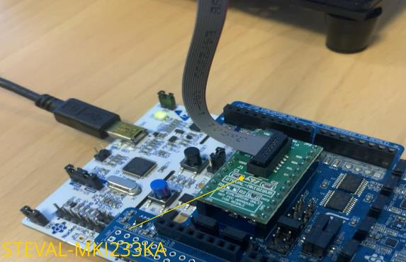
    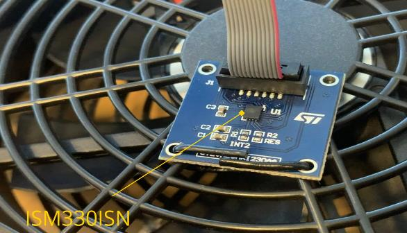

Other hardware configurations can be used to obtain the same results, but the user must check the support of the NEAI Studio and the X-CUBE-ISPU package.

In the example used for this tutorial, the anomaly detection runs to detect anomalies of a fan coil that supports three different speeds.

## 1. How to generate the library using NEAI Studio

### 1.1 Datalogger

When opening NEAI Studio, the first step is to open the datalogger section, where you can find many different board configurations you can use to collect data for the anomaly-detection algorithm.

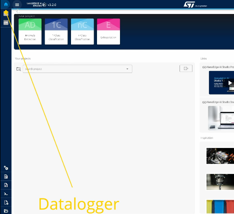

The configuration used for this tutorial must be selected as shown in the image below.

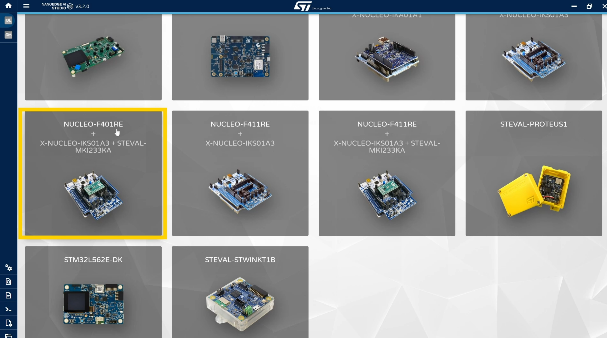

Then, the parameters for the data acquisition must be selected. For this tutorial:
-   Data rate (Hz): 416 Hz
-   Range (g): 2 g
-   Sample size per axis: 128
-   Number of axes: 3

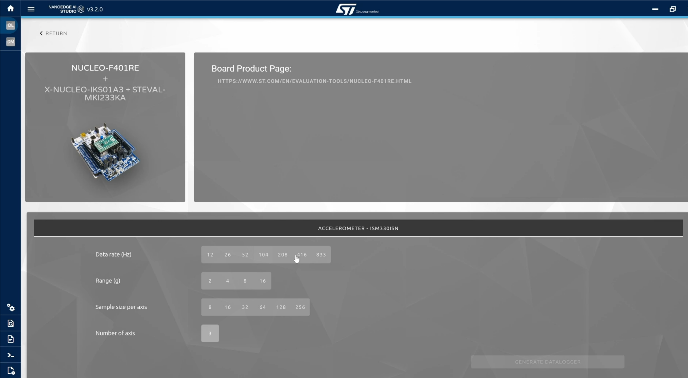

Once the hardware configuration and all the parameters have been chosen, click on the "GENERATE DATALOGGER" button to download the *.bin* file and flash it to the Nucleo board.

### 1.2 Project creation

Once the datalogger is ready, it is possible to start building the anomaly-detection use case with NEAI Studio by creating a new project. The process for generating the anomaly-detection library is subdivided into 7 steps.

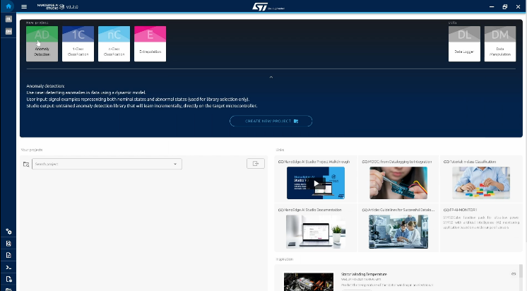

### 1.3 Project settings

First of all (NEAI step 1), a name must be given to the project and the right target device must be selected: for this tutorial the ISM330ISN must be selected.

For other targets, the settings for the max RAM, the max flash, and the sensor type must be selected. For target devices embedding the ISPU, all the parameters are already set.

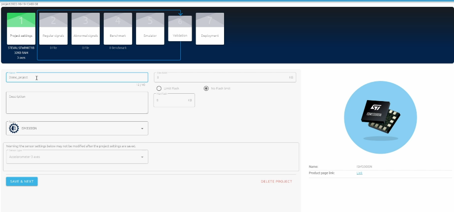

### 1.4 Getting normal signals

For the next step (NEAI step 2), click on "ADD SIGNAL" to collect data for the normal behavior of the fan. Selecting the option from a serial USB, it is possible to stream and get data directly from the board that was flashed with the datalogger firmware.

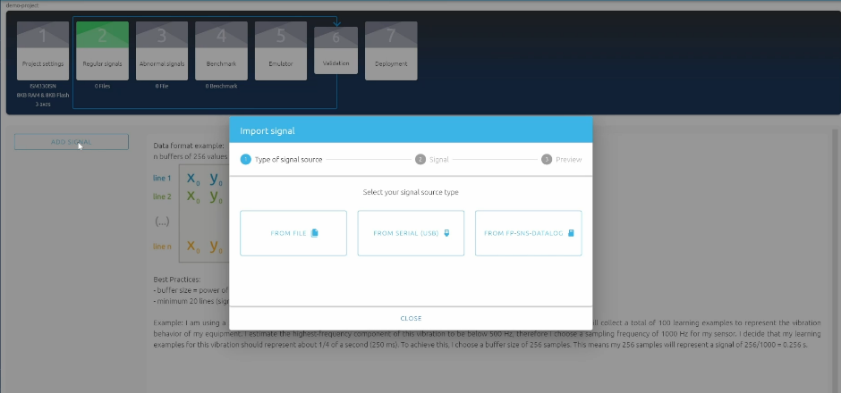

The correct COM port should be selected and the baud rate fixed at 115200.

For this example, a normal signal is captured while the fan coil is running at its max speed. After setting the coil to its max speed, click on START to start streaming and recording the data. It is possible to collect as much data as desired, but for the purpose of this tutorial, 100 samples should be enough.

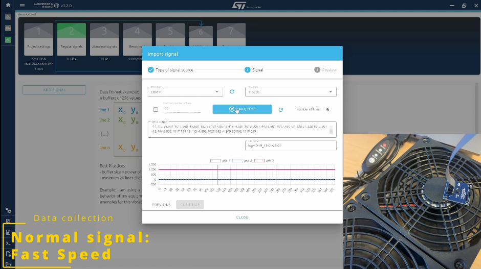

For the sake of simplicity, only data representing one mode of operation are collected (max fan speed). However, it is possible to gather more data representing all the different states that are to be considered as the normal behavior of the fan.

Once the data is collected and imported, on the right-hand side of the page, there is a preview of the imported data, including FFT plots for all the accelerometer axes.

There is also the possibility to manually add filters to remove unwanted frequencies and immediately see the effects on the plots. For this tutorial, no filter is configured.

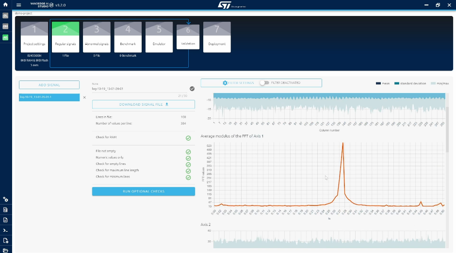

### 1.5 Getting abnormal signals

In the next step (NEAI step 3), data must be collected for the abnormal behavior of the fan. For this tutorial, the fan operating at the slowest speed represents abnormal behavior.

Following the same procedure as per the normal signals, abnormal signals must be collected using the datalogger firmware (100 samples or more).

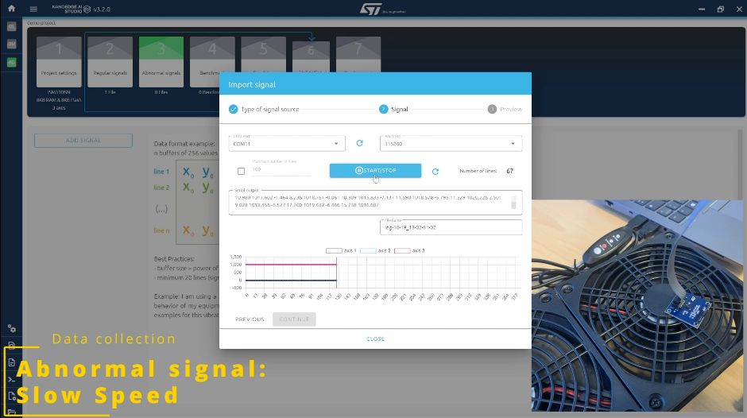

Note that the signal examples that are provided at this point are not used to train the anomaly-detection library, they are only used to provide some context for the automatic search of the best machine learning model. The actual learning occurs in real time after the library has been embedded in the ISPU. The examples of anomalies provided here do not need to be exhaustive. For a real use case, for instance, they can be collected from a faulty machine or under conditions known to be abnormal or, if possible, they can be created artificially. When testing the library, it is possible to detect anomalies that were never seen before, because the learning is performed in real time on the normal behavior data only.

Once all the signals have been collected and imported, once again it is possible to check the data via the plots.

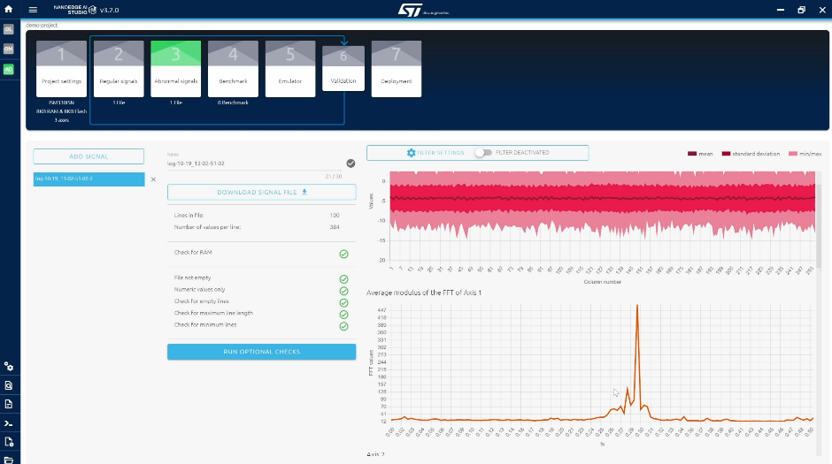

### 1.6 Benchmark

During the next step (NEAI step 4), NEAI Studio searches for the best possible library for the specific use case, given the signals provided in the previous steps. In this optimization process, NEAI studio looks for the best:
-   Signal preprocessing: this could be very simple such as offsetting, normalizing, or more complex like FFT or PCA.
-   Machine learning model: there are several mode types, such as KNN, SVN, and NN.
-   Hyperparameters of the model so that it can solve the problem as effectively and efficiently as possible.

During the process, each candidate library is tested using the signals previously imported. The library learns the normal signals and then runs in detection mode on both normal and abnormal signals.

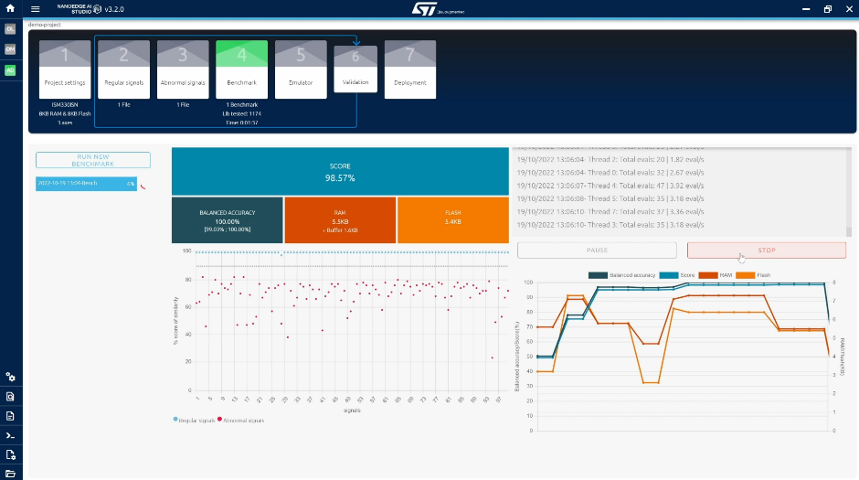

The results are displayed in the graph above. On the X-axis there is the signal number, while the Y-axis represents the percentage of similarity between that signal and the normal signals used for learning. The similarity value is the output of the library currently being tested.

The ideal situation is to have all the blue dots, which correspond to the normal signals, to be as close as possible to 100% and all the red points, which represent the abnormal signals, as close as possible to 0%.

The most important performance indicator is the balanced accuracy, which translates the ability of the library to correctly classify the input signals as normal or abnormal; 100% accuracy would mean that all the blue points are above the 90% decision boundary and all the red are below.

Finally, the amounts of RAM and FLASH memory occupied by the library are also optimized and displayed.

### 1.7 Emulator

In the next step (NEAI step 5), it is possible to test the library directly from NEAI Studio to check if the library generated in the previous step works properly.

During the learning phase, the Nucleo with the datalogger firmware can be used again to stream data while the fan is in normal conditions (fan at max speed). Anomaly-detection libraries are untrained after the benchmark and that is why it is needed to run an initial learning cycle so that the library can learn the normal behavior.

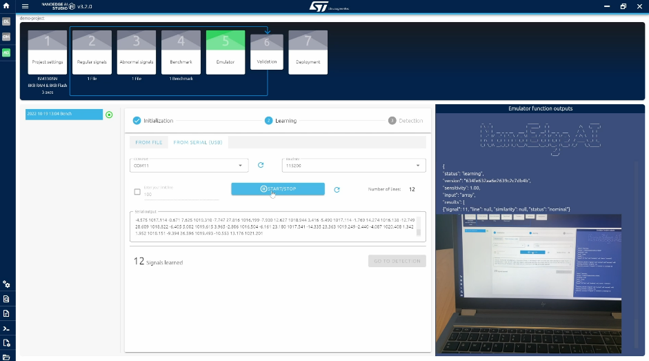

Moving to the detection phase, it is possible to observe the results of the library based on the data being streamed. The result should show 100% similarity (or anyway a high value) since the fan is running in normal conditions.

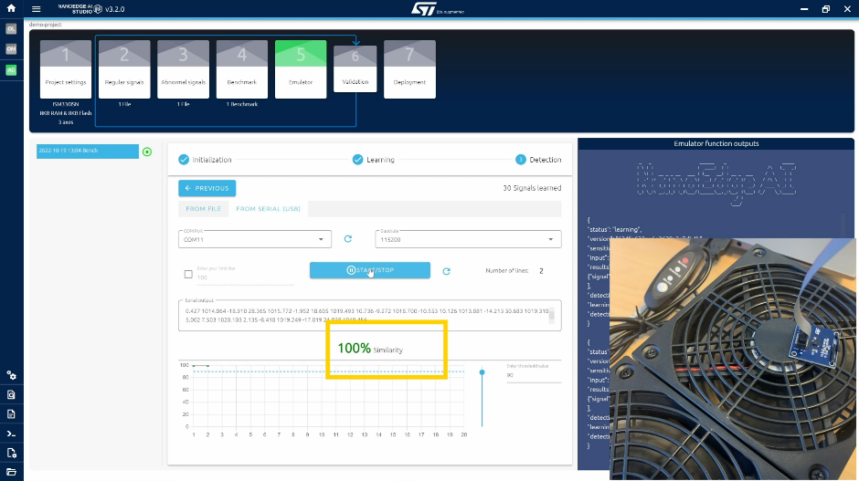

When changing the fan speed, the similarity should immediately start to drop.

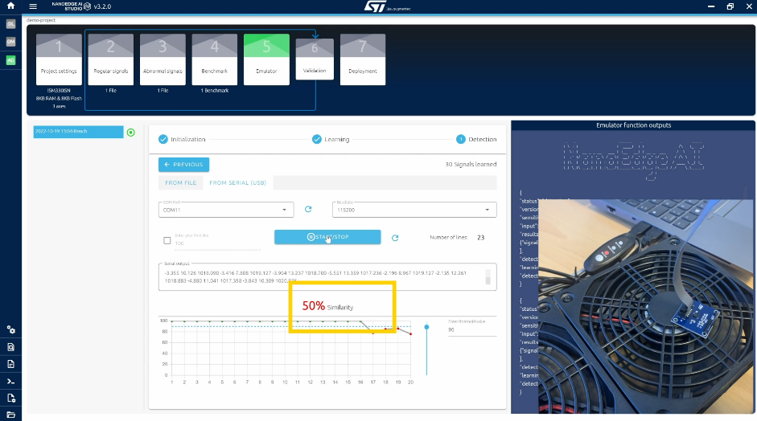

One thing to highlight is that, in this example, the fan slow speed was used as abnormal behavior. However, if the fan was turned off, or if the user tapped on the fan, the anomaly would also be detected.

### 1.8 Validation

Once the library has been tested with the emulator, the next step (NEAI step 6) is just a summary of the generated library highlighting the overall score, the balanced accuracy, and the algorithm flowchart.

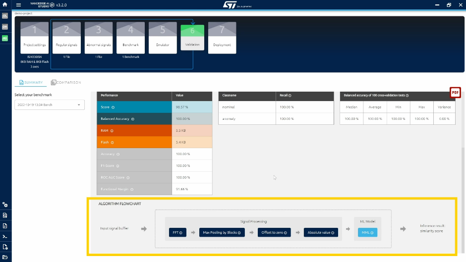

### 1.9 Deployment

The last step in NEAI studio (NEAI step 7) requires clicking on "COMPILE LIBRARY" and then on "DEMO version" in order to download the library in a *.zip* package.

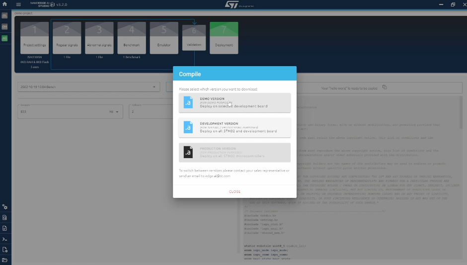

The image below shows the contents of the package.

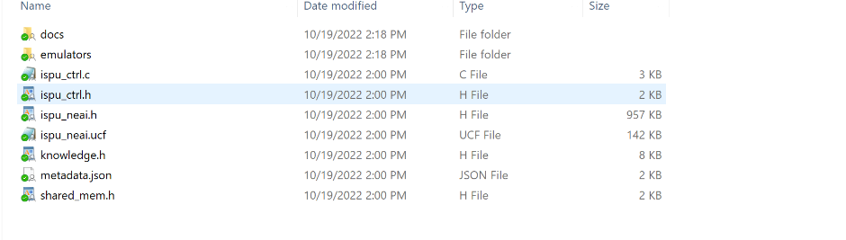

## 2. How to test the generated library on the ISPU

Once the best possible library has been generated, it can be tested on the ISPU using the same hardware setup used for data logging.

### 2.1 Copy NEAI library to Nucleo firmware project

The X-CUBE-ISPU software package contains ready-to-use firmware for testing NEAI libraries. The location of the project implementing this firmware depends on the Nucleo board used. In this case, from the X-CUBE-ISPU root folder, it is in:

*Projects\\NUCLEO-F401RE\\Examples\\CUSTOM\\ISM330ISN_NEAI_AnomalyDetection*

Inside the project, in the *Core\\Inc* folder, you can find some files already present that must be replaced with the files generated by NEAI Studio. These files are:
-   ispu_neai.h
-   ispu_ctrl.h

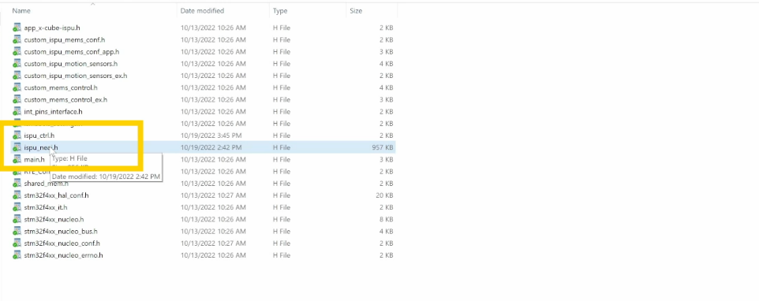

The *ispu_neai.h* file contains the configuration for the ISPU (including the NEAI library) and the sensor itself. The *ispu_ctrl.h* file contains information needed by the Nucleo firmware in order to interact with the NEAI library running on the ISPU (for example, the number of axes and number of samples used by the NEAI library).

### 2.2 Build and flash the Nucleo firmware

After replacing the NEAI library files, the Nucleo project must be imported from the STM32CubeIDE in order to build it and flash it.

In order to import the project, go to "File", click on "Import..."; under "General", select "Existing Project into Workspace", click on the "Next" button, click on the "Browse" button, select the folder containing the project (Projects\\NUCLEO-F401RE\\Examples\\CUSTOM\\ISM330ISN_NEAI_AnomalyDetection\\STM32CubeIDE), and click on the "Finish" button.

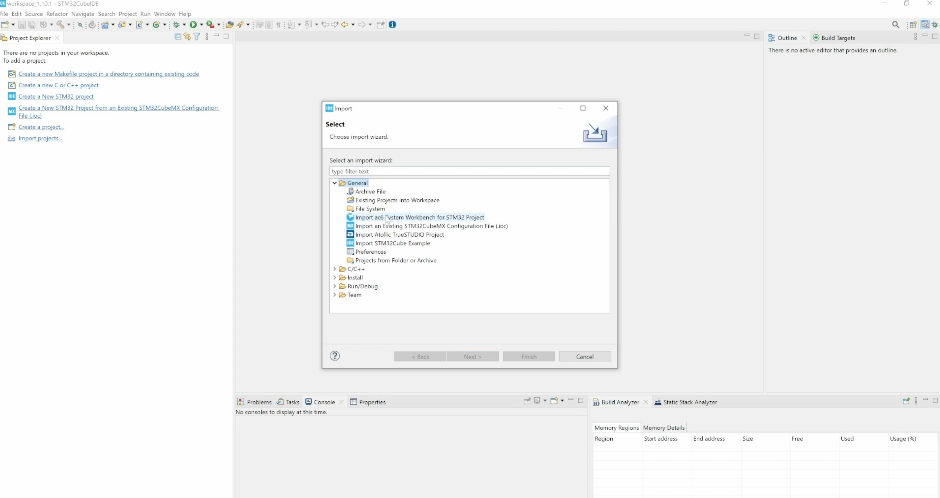

The firmware works as follows:
-   At the start, the library running on the ISPU is set in learning mode. The learning phase lasts 20 seconds.
-   Once the learning is completed, the library is set in detection mode. In this mode, the library checks if the signals match the normal state.
- If an anomaly is detected, the ISPU raises an interrupt, which is received by the Nucleo, which in turn retrieves the data corresponding to the anomaly from the ISPU and sends it to the serial port.

The project can be built by pressing the *hammer* button at the top left of the screen. In order to flash and launch the firmware, press the *play* button in the green circle.

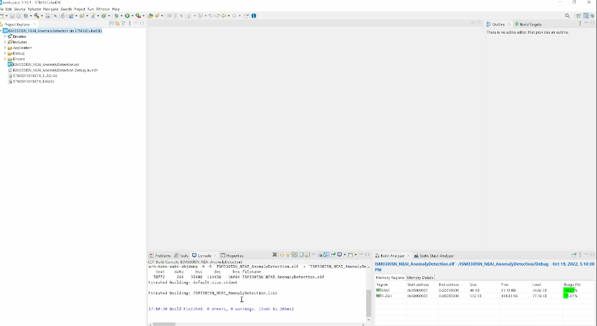

### 2.3 Checking the results

For this tutorial, PuTTY is used in order to see the results printed by the Nucleo board on the serial port. Launching PuTTY, the first step is to set the setting for the "Session": select the serial mode and write the correct serial line and speed. While the serial line can vary, the speed to set for this firmware is always 115200.

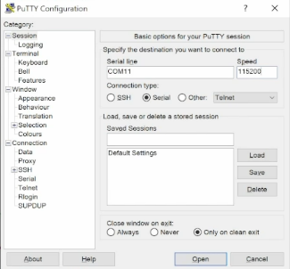

For a correct visualization, in the "Terminal" settings, flag the following options:
-   Implicit CR in every LF
-   Implicit LF in every CR

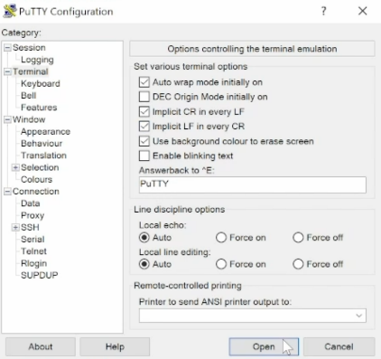

By clicking on "Open", the terminal displays the messages sent by the Nucleo firmware.

As anticipated, the first step is the learning phase based on the normal data. The Nucleo displays the progress as shown in the image below.

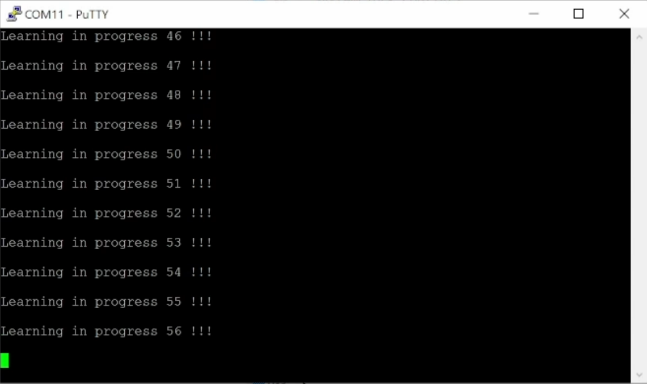

As soon as the learning is completed, the message "Learning phase END" is displayed, and library switches to detection mode.

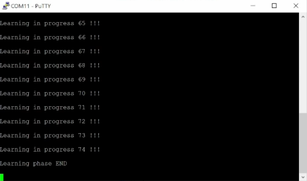

In normal conditions (no anomaly detected), there is no message from the Nucleo board. As soon as an anomaly is detected, the corresponding data starts streaming on the serial port.

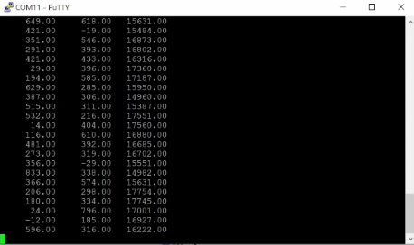

# Conclusions

In this tutorial it was explained how to use a MEMS sensor embedding the ISPU with NEAI Studio in order to create an anomaly-detection solution. NEAI Studio allows finding the best possible library among many combinations starting from a set of normal and abnormal signals. The X-CUBE-ISPU software package provides firmware to integrate and test the NEAI library generated by NEAI Studio.

You can check the following link for a step-by-step webinar on the same topic: [https://content.st.com/st-intelligent-sensors-for-anomaly-detection-and-AI-webinar.html](https://content.st.com/st-intelligent-sensors-for-anomaly-detection-and-AI-webinar.html).

------

**More information: [http://www.st.com](http://st.com/MEMS)**

**Copyright © 2023 STMicroelectronics**
