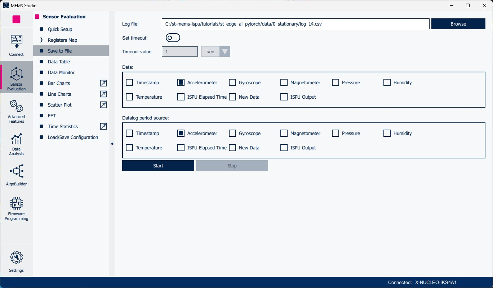
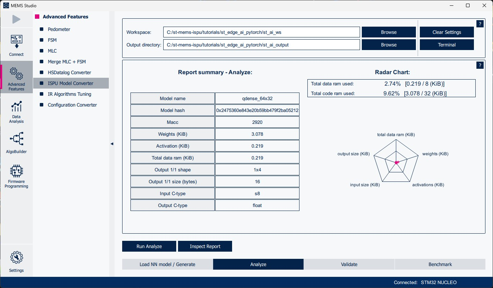
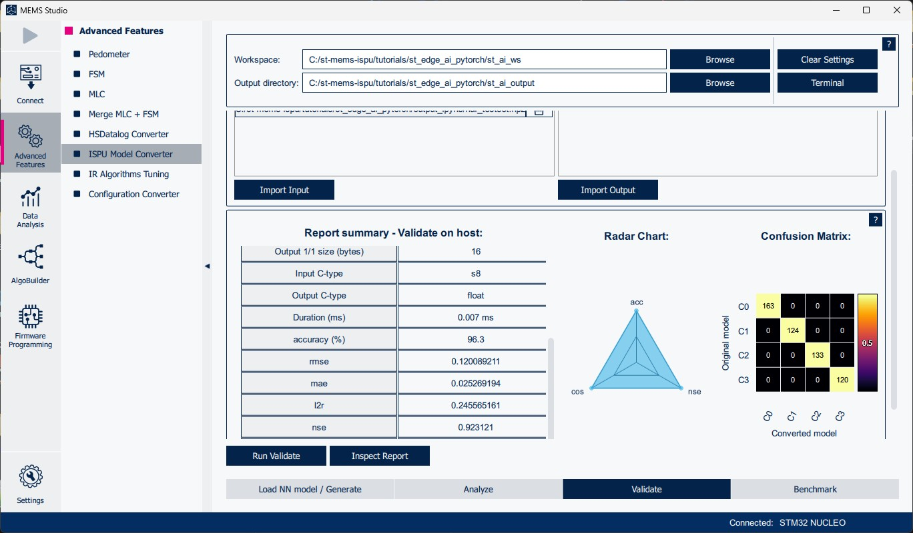
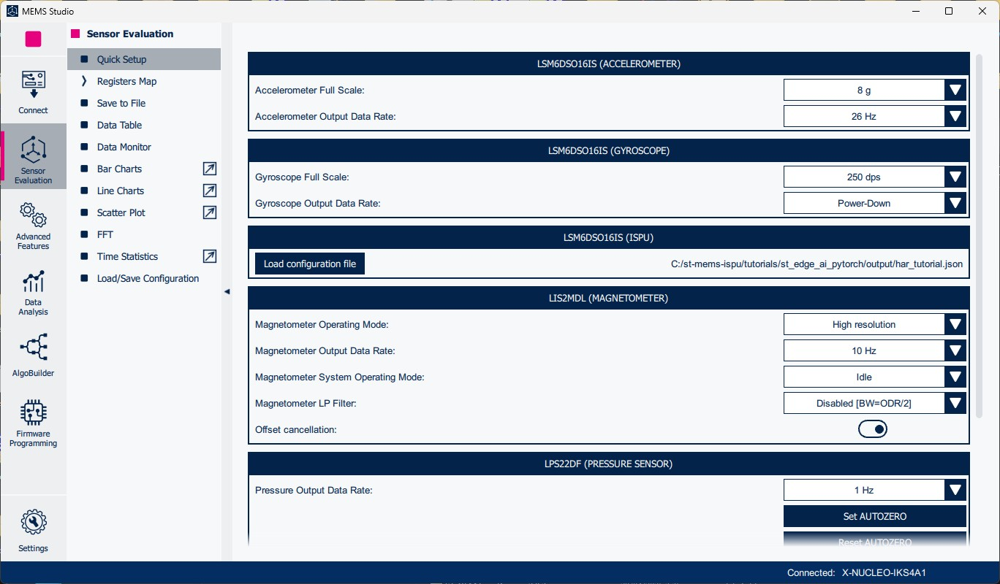
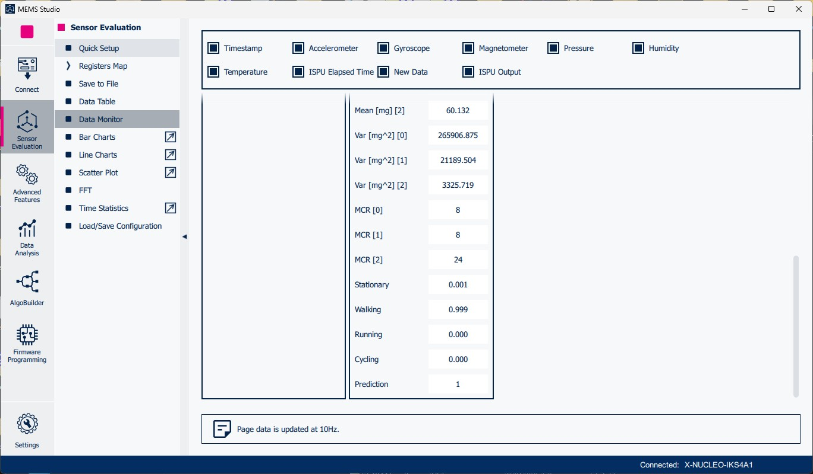

# ST Edge AI for ISPU tutorial using PyTorch

This tutorial demonstrates the complete flow for deploying a neural network trained with PyTorch inside a sensor embedding the ISPU using [ST Edge AI Core](https://www.st.com/en/development-tools/stedgeai-core.html).

The use case consists of a human activity recognition (HAR) using accelerometer data to train a small neural network (NN) to recognize four activities: stationary, walking, running, and cycling.

## Requirements

For reproducing all the steps in this tutorial project, the following hardware and software components are required.

### Hardware

- [NUCLEO-F401RE](https://www.st.com/en/evaluation-tools/nucleo-f401re.html): STM32 Nucleo board supported by ST tools and software packages.

    

- [X-NUCLEO-IKS4A1](https://www.st.com/en/ecosystems/x-nucleo-iks4a1.html): motion MEMS and environmental sensors expansion board, which must be connected to the NUCLEO-F401RE through the Arduino UNO V3 connector.

    

### Software

- [ISPU-Toolchain](https://www.st.com/en/development-tools/ispu-toolchain.html): toolchain to build applications for sensors embedding the ISPU, which must be added to the system PATH (for detailed steps refer to the dedicated [README](https://github.com/STMicroelectronics/ispu-examples/README.md)).
- [ST Edge AI Core](https://www.st.com/en/development-tools/stedgeai-core.html): tool to easily convert pretrained AI models for integration into ST products, which must be added to the system PATH (for detailed steps refer to the "Setting environment" article of the documentation available within the ST Edge AI Core installation folder).
- [GNU Make](https://www.gnu.org/software/make): command line build tool, which must be added to the system PATH.
- [MEMS Studio](https://www.st.com/en/development-tools/MEMS-Studio.html): desktop software solution to develop and test solutions for MEMS sensors.
- [X-CUBE-ISPU](https://www.st.com/en/embedded-software/x-cube-ispu.html): expansion package for ISPU development containing documentation, examples, and STM32 firmware for enabling communication with MEMS Studio.
- [Python](https://www.python.org): Python programming language interpreter, necessary to create and train the neural network model (required Python packages are listed in `requirements.txt`). A version of Python ≤ 3.11 is required.
- [Jupyter Notebook](https://jupyter.org/install): interactive computing platform accessible from the web browser to run Python code.

## Dataset acquisition

For the first step of this tutorial, the Nucleo board (with the expansion board and adapter board mounted on top) and MEMS Studio can be used to collect multiple data logs for each of the activities.

1. Mount the X-NUCLEO-IKS4A1 expansion board on top of the NUCLEO-F401RE board and connect it to a USB port of your computer. Do not plug any sensor adapter board in the DIL24 socket if it hosts a sensor with the same I2C address as the LSM6DSO16IS sensor already available on the expansion board, as a clash of addresses does not allow the firmware to work correctly.

    

2. Flash the [LSM6DSO16IS_DataLogExtended.bin](https://github.com/STMicroelectronics/x-cube-ispu/blob/main/Projects/NUCLEO-F401RE/Examples/IKS4A1/LSM6DSO16IS_DataLogExtended/Binary/LSM6DSO16IS_DataLogExtended.bin) firmware from the X-CUBE-ISPU package to enable communication between MEMS Studio and the sensor (this can be achieved simply by copying the *.bin* file to the board mass storage).

3. Open MEMS Studio, under `Connect`, select `Serial` as `Communication type` and the serial port the board is connected to as `Communication port`, and then press `Connect`. Then, if not already showing, select `LSM6DSO16IS` under the `Accelerometer sensor` dropdown menu and press `Select`.

    

4. Go to the `Sensor Evaluation` section and select the `Quick Setup` page to configure the sensor (`Accelerometer Full Scale`: 8 g; `Accelerometer Output Data Rate`: 26 Hz), then press the `▶` button in the top left corner to start streaming data from the sensor.

    

5. Go to the `Save to File` page, select a save path for the CSV log in the `data/<id>_<activity>` folder (where `<activity>` corresponds to the desired activity name and `<id>` corresponds to the numeric identifier of the activity used for its classification), select only `Accelerometer` in both `Data` and `Datalog period source` sections.

    

6. Use the `Start` / `Stop` buttons to start and stop data collection making sure to acquire data in the most realistic setting with only one activity type per log.

### PAMAP2 dataset

Several CSV logs are already available in the `data` folder and are sufficient to obtain good training results, however, the user is free to add new logs or customize the activities.

These logs were derived from a public HAR dataset (Reiss, Attila. (2012). PAMAP2 Physical Activity Monitoring. UCI Machine Learning Repository. [https://doi.org/10.24432/C5NW2H](https://doi.org/10.24432/C5NW2H)), which was cleaned/pre-processed for the purpose of this tutorial. The following steps have been applied to the original dataset:

- Only keep logs acquired from the wrist-mounted sensor and only from { *lying*, *sitting*, *standing*, *watching_TV*, *walking*, *nordic_walking*, *upstairs*, *downstairs*, *running*, *cycling* } activities.
- Merge { *lying*, *sitting*, *standing*, *watching_TV* } into *stationary* class, and { *walking*, *nordic_walking*, *upstairs*, *downstairs* } into *walking* class.
- Visually inspect data and remove start/stop segments where no tasks are being performed.
- Only keep accelerometer X, Y, and Z axes data and convert it to mg scale.
- Resample data from 100 Hz to 26 Hz using Fourier method.
- Segment CSV logs into multiple logs of 1 minute each.
- Balance dataset by keeping the same number of logs for each class.
- Convert logs to the MEMS Studio CSV format.

In addition to the data from the PAMAP2 dataset, a log with the device stationary in different orientations has been collected to make the model more robust.

## Model Training

Once a decent-sized dataset has been acquired, the training of the model on the collected data is the next step. To make this process as easy as possible, a ready-to-use notebook (`har_tutorial.ipynb`) is provided.

### Steps

By running all cells in this notebook, the following steps are performed:

1. Load data from the CSV logs contained in the `data/<id>_<activity>` folders.
2. Segment data into 2-second windows without overlap.
3. Label windows using the corresponding `<id>` value.
4. Compute the mean, variance, and mean-crossing rate for the three accelerometer axes.
5. Divide dataset into training (63%), validation (7%), and testing (30%) sets.
6. Normalize the features by applying a standard scaling with mean and standard deviation parameters computed on the train set.
7. Train a small dense network (2852 parameters).
8. Quantize model weights from `float` to `int8` representation.

    Note: Performing model quantization may entail trading some accuracy for significantly reducing the model size.

At the end of the procedure, both the original and quantized models and the test set are saved in the `output_ipynb` folder. In addition, the notebook prints the standard scaling parameters to copy to the C code for the final integration of the network on the ISPU.

The notebook uses PyTorch and ONNX to create, train, and quantize the model in the Quantize-Dequantize-Quantize (QDQ) format, but other frameworks could be used instead (Keras and TensorFlow Lite, etc.).

### Customization

To customize the activities recognized by the model, the user can just add/remove activity folders in `data`. For example, for adding a new driving activity, the user needs to create a `data/4_driving` folder where all CSV logs corresponding to that activity will be placed.

### How to run the Jupyter Notebook

To be able to run the provided Jupyter Notebook, please follow these steps:

1. (Optional) Create a Python virtual environment using [venv](https://docs.python.org/3/library/venv.html), [Anaconda](https://docs.conda.io/projects/conda/en/latest/user-guide/install/index.html) / [Miniconda](https://docs.conda.io/en/latest/miniconda.html) or any other similar tool to avoid conflicts with previously installed Python packages.

2. Install the required modules by using the following shell command from the folder of this tutorial:

    ```powershell
    pip install -r requirements.txt
    ```

3. Start the [Jupyter](https://jupyter.org) server by running:

    ```powershell
    jupyter notebook
    ```

    and open in a web browser the URL displayed in your shell.

    Alternatively, a [Visual Studio Code extension](https://marketplace.visualstudio.com/items?itemName=ms-toolsai.jupyter) is also available for Jupyter integration in Visual Studio Code, which will take care of starting the Jupyter server in the background.

4. Run all the Jupyter Notebook cells.

## ST Edge AI Core command line usage

Having successfully trained a model, ST Edge AI Core can now be used to integrate it inside the ISPU and inspect its behavior for developing an accurate and reliable application.

### Analyze

To assist in deciding which model is more suited for ISPU integration, the `analyze` command can be used to obtain useful information regarding its memory footprint and the number of operations.

By running the following command the original float model can be analyzed:

```powershell
stedgeai analyze --target ispu --model output_ipynb/dense_64x32.onnx --no-workspace
```

Here is the summary from the `st_ai_output/network_analyze_report.txt` report:

```
Exec/report summary (analyze)
-----------------------------------------------------------------------------------------------------
model file         :   /st/st-mems-ispu/tutorials/st_edge_ai_pytorch/output_ipynb/dense_64x32.onnx
type               :   onnx
c_name             :   network
options            :   allocate-inputs, allocate-outputs, use-lite-runtime, use-st-ai
optimization       :   balanced
target/series      :   ispu
workspace dir      :   /tmp/stedgeai_workspace
output dir         :   /st/st-mems-ispu/tutorials/st_edge_ai_pytorch/st_ai_output
model_fmt          :   float
model_name         :   dense_64x32
model_hash         :   0x9a6040575dee5adcbade202d37d2e49a
params #           :   2,852 items (11.14 KiB)
-----------------------------------------------------------------------------------------------------
input 1/1          :   'onnxGemm_0', f32(1x9), 36 Bytes, activations
output 1/1         :   'node_12', f32(1x4), 16 Bytes, activations
macc               :   3,008
weights (ro)       :   11,408 B (11.14 KiB) (1 segment)
activations (rw)   :   384 B (384 B) (1 segment) *
ram (total)        :   384 B (384 B) = 384 + 0 + 0
-----------------------------------------------------------------------------------------------------
(*) 'input'/'output' buffers can be used from the activations buffer
```

If the ISPU-Toolchain is detected on the system PATH, ST Edge AI Core will use it to estimate the memory footprint of the converted model taking into accout also its code size:

```
  Summary - "ispu" target
  ----------------------------------------------------------
               Code RAM (ro)      %*   Data RAM (rw)      %
  ----------------------------------------------------------
  RT total             7,344   39.2%               8   2.0%
  ----------------------------------------------------------
  TOTAL               18,752                     392
  ----------------------------------------------------------
  *  rt/total
```

Alternatively, for the quantized model, run the following command:

```powershell
stedgeai analyze --target ispu --model output_ipynb/qdense_64x32.onnx --no-workspace --input-data-type float32
```

The `--input-data-type float32` option must be specified in order to have the converted model accept the inputs in float format and apply the quantization internally.

Here is the summary from the `st_ai_output/network_analyze_report.txt` report:

```
Exec/report summary (analyze)
------------------------------------------------------------------------------------------------------
model file         :   /st/st-mems-ispu/tutorials/st_edge_ai_pytorch/output_ipynb/qdense_64x32.onnx
type               :   onnx
c_name             :   network
options            :   allocate-inputs, allocate-outputs, use-lite-runtime, use-st-ai
optimization       :   balanced
target/series      :   ispu
workspace dir      :   /tmp/stedgeai_workspace
output dir         :   /st/st-mems-ispu/tutorials/st_edge_ai_pytorch/st_ai_output
model_fmt          :   ss/sa per tensor
model_name         :   qdense_64x32
model_hash         :   0x2475360e843e20b59bb479f2ba05212c
params #           :   2,852 items (11.14 KiB)
------------------------------------------------------------------------------------------------------
input 1/1          :   'onnxGemm_0', f32(1x9), 36 Bytes, activations
output 1/1         :   'node_12', f32(1x4), 16 Bytes, activations
macc               :   2,938
weights (ro)       :   3,152 B (3.08 KiB) (1 segment) / -8,256(-72.4%) vs float model
activations (rw)   :   224 B (224 B) (1 segment) *
ram (total)        :   224 B (224 B) = 224 + 0 + 0
------------------------------------------------------------------------------------------------------
(*) 'input'/'output' buffers can be used from the activations buffer
```

```
  Summary - "ispu" target
  ----------------------------------------------------------
               Code RAM (ro)      %*   Data RAM (rw)      %
  ----------------------------------------------------------
  RT total             9,096   74.3%               8   3.4%
  ----------------------------------------------------------
  TOTAL               12,248                     232
  ----------------------------------------------------------
  *  rt/total
```

Comparing the reports before and after the quantization:

- `macc`: 3008 → 2938
- `weights`: 11408 B → 3152 B
- `code ram (ro)`: 18752 B → 12248 B
- `data ram (rw)`: 392 B → 232 B

After quantization, the network has about the same number of *macc* operations, and *weights* now occupy ~72% less memory. A lesser but still significant reduction can be observed for *code ram (ro)*, which is ~35% less occupied; the mismatch with the *weights* reduction is due to code overhead (needed to handle inference computations in the quantized network). A significant reduction can also be observed for *data ram (rw)*, which is 41% less occupied; however, in this case, the value of this parameter could be considered negligible in both the float and quantized models.

Note: The larger the model the less impact the code overhead will have on the final code size; for this reason, it is always recommended to run the `analyze` command on the model before proceding further in the development process with ST Edge AI Core.

Given the results obtained from the comparison of the model before and after the quantization, the next steps in the tutorial will focus only on the quantized model.

### Generate

The actual conversion step is performed using the `generate` command, which enables the user to easily generate a C library optimized for the ISPU architecture from the trained model.

By running the following command, the quantized model can be converted:

```powershell
stedgeai generate --target ispu --model output_ipynb/qdense_64x32.onnx --output generated --no-workspace --no-report --input-data-type float32
```

The result of this operation is the creation of C files (.c/.h), containing model-specific code and data, and a C runtime library (.h/.a), that make the model inference possible on the ISPU, inside the specified output folder `generated`.

### Validate

To evaluate the model performance and the correctness of the conversion performed by ST Edge AI Core, the `validate` command can be used.

The command offers various functionalities but, in its basic form, by inputting the model with no extra arguments, the tool will generate random data to be used as input to both the original and converted model to check that predictions coincide; alternatively, the user can provide the input / output data directly to ensure more control over the frequencies of the predicted classes.

Another useful option is the ability to perform the validation on target to check the correctness of the converted model on the final target (LSM6DSO16IS) and obtain a measurement of its execution time. In order to do that, first of all, the Nucleo board must be flashed with the [nucleo_f401re_ispu_stedgeai_validate.bin](../../host_firmware/nucleo_ispu_stedgeai_validate/binary/nucleo_f401re_ispu_stedgeai_validate.bin") firmware. Then, the generated C model must be copied inside the [template_stedgeai_validate](https://github.com/STMicroelectronics/ispu-examples/tree/master/ism330is_lsm6dso16is/template_stedgeai_validate) project that must be compiled to create a sensor configuration (.ucf) file:

1. First, copy the `template_stedgeai_validate` project available in the examples folder of this repository:

    ```powershell
    cp -r ../../examples/ism330is_lsm6dso16is/template_stedgeai_validate/ispu ispu_validation
    ```

2. Then copy the content of `generated` inside the template project:

    ```powershell
    cp -r generated/* ispu_validation
    ```

3. Lastly, compile the project using `make` to generate the sensor configuration (.ucf) file and copy it to the `output` folder:

    ```powershell
    make -C ispu_validation/make
    cp ispu_validation/make/bin/ispu.ucf output/har_validate.ucf
    ```

    Note: Make sure you have the ISPU-Toolchain correctly set up on your system to be able to compile the code for the ISPU architecture.

    In alternative to using `make`, the project can be compiled using the Eclipse project pre-configured in the `ispu_validation/eclipse` folder.

Finally, having completed all the previous steps, it is possible to perform the validation on target by connecting the Nucleo board to a USB port of the PC, and running the `validate` command specifying the model (.onnx), the sensor configuration (.ucf), and the validation data (.npz) as arguments:

```powershell
stedgeai validate --target ispu --mode target --model output_ipynb/qdense_64x32.onnx --valinput output_ipynb/har_testset.npz --ucf output/har_validate.ucf --no-workspace --input-data-type float32
```

The `st_ai_output/network_validate_report.txt` report includes information about the execution time and model accuracy:

```
ST.AI Profiling results v2.0 - "network"
---------------------------------------------------------------
nb sample(s)   :   540
duration       :   11.970 ms by sample (11.733/12.052/0.097)
macc           :   2938
cycles/MACC    :   20.37
---------------------------------------------------------------
```

The most important piece of information here is given by the `duration` field, which reports that the model inference is taking ~12 ms for its execution; this is an important parameter to know for running the model in real time.

```
Evaluation report (summary)
------------------------------------------------------------------------------------------------------------------------------------------------------------
Output              acc       rmse          mae           l2r           mean        std        nse        cos        tensor
------------------------------------------------------------------------------------------------------------------------------------------------------------
TARGET c-model #1   96.30%    0.120089211   0.025269194   0.245565161   -0.000000   0.120117   0.923121   0.970756   'node_12', 540 x f32(1x4), m_id=[18]
original model #1   96.30%    0.120089211   0.025269194   0.245565161   -0.000000   0.120117   0.923121   0.970756   'node_12', 540 x f32(1x4), m_id=[18]
X-cross #1          100.00%   0.000000001   0.000000000   0.000000002   0.000000    0.000000   1.000000   1.000000   'node_12', 540 x f32(1x4), m_id=[18]
------------------------------------------------------------------------------------------------------------------------------------------------------------
```

In the evaluation report, three rows of results are reported, their meaning is the following:

- TARGET c-model: performance of the converted model using given outputs as ground-truth.
- original model: performance of the original model using given outputs as ground-truth.
- X-cross: performance of the converted model using the original model outputs as ground-truth.

In this case, the converted model performance is practically the same as the original model (for more details on validation metrics refer to the "Evaluation metrics" article of the documentation available within the ST Edge AI Core installation folder).

## ST Edge AI integration in MEMS Studio

To accomodate users that prefer to use a graphical interface over the command line, ST Edge AI Core has been integrated in MEMS Studio.

After opening MEMS Studio, go to the `Advanced Features` section and select the `ISPU Model Converter` page. In the lower portion of the page are located four buttons that open up subpages corresponding to ST Edge AI Core's main functionalities:

- Load NN model / Generate: generate the converted model for the ISPU architecture starting from the original model.

    

- Analyze: obtain useful information regarding the model's memory footprint and complexity.

    

- Validate: evaluate the model performance and the correctness of the conversion performed by ST Edge AI Core.

    - On host: run the validation on the user's computer.

        

    - On target: run the validation directly on the ISPU (note: requires the Nucleo board to be flashed with the [nucleo_f401re_ispu_stedgeai_validate.bin](../../host_firmware/nucleo_ispu_stedgeai_validate/binary/nucleo_f401re_ispu_stedgeai_validate.bin") firmware).

        

- Benchmark: assess all benchmark results (original model, c-model, and X-cross) from both host and target validations.

    

## ISPU firmware integration

After the validation phase, if the results are satisfactory, the next step is the integration inside the ISPU firmware and the implementation of the actual logic of the application.

The first step is to copy the [template_stedgeai](https://github.com/STMicroelectronics/ispu-examples/tree/master/ism330is_lsm6dso16is/template_stedgeai) project and add the C code generated from the model:

```powershell
cp -r ../../examples/ism330is_lsm6dso16is/template_stedgeai/ispu ispu_integration
cp -r generated/* ispu_integration
```

Then, for the actual integration, the `main.c` template must be modified to do the following steps:

1. Read accelerometer data and compute mean, variance, and mean-crossing rate every 52 samples.
2. Run the model inference at the end of each window of 52 samples to obtain the prediction.
3. Write the model prediction in the ISPU output registers.

### Add definitions and global variables

The integration template is agnostic of the specific application, therefore, as a first step, all relevant information, such as the accelerometer sensitivity, must be added.

```c
#define ACC_SENS 0.244f // [mg/LSB]
#define ACC_NUM_AXES 3
#define WIN_LEN 52
```

Next, the variables to implement the application logic are needed. In this case: arrays to store the means, variances, and mean-crossing rates, a signal buffer to store the accelerometer samples to compute the mean-crossing rates at the end of the detection window, a counter to know when all the samples of the window have been processed, and the parameters (mean and standard deviation copied from the output of the Jupyter notebook) for the normalization of the features. The standard deviations are stored in their inverse form to improve performance by avoiding divisions.

```c
static float mean[ACC_NUM_AXES];
static float var[ACC_NUM_AXES];
static uint8_t mcr[ACC_NUM_AXES];
static float signal_buf[WIN_LEN][ACC_NUM_AXES];

static uint8_t win_cnt;

// standard scaler parameters
static const float features_mean[STAI_NETWORK_IN_1_CHANNEL] = {
	-489.4554374956601f,
	536.8898007211596f,
	315.4528401601346f,
	516806.8996868161f,
	992323.5776839033f,
	86117.80626196241f,
	15.409532215357459f,
	17.17828773168579f,
	16.784642541924097f
};

static const float features_inv_std_dev[STAI_NETWORK_IN_1_CHANNEL] = {
	0.002183945503568183f,
	0.001915411784024902f,
	0.0026443263488319492f,
	1.026182957270523e-06f,
	4.857604595408713e-07f,
	6.19934087047198e-06f,
	0.09091009321406888f,
	0.104295242626417f,
	0.1065995815529936f
};
```

### Initialize algorithm state

To ensure correct functioning, the initialization logic must be placed inside the `algo_00_init` function.

```c
void __attribute__ ((signal)) algo_00_init(void)
{
	(void)stai_runtime_init();
	(void)stai_network_init(net); // initialize the network context

	init_network_buffers(net, input_buffers, output_buffers);

	// initialize state variables and buffers
	reset_status();
}

static void reset_status(void)
{
	for (uint8_t ax = 0; ax < ACC_NUM_AXES; ax++) {
		mean[ax] = 0.0f;
		var[ax] = 0.0f;
		mcr[ax] = 0;
	}
	win_cnt = 0;
}
```

Compared to the template, the `reset_status` function was added to reset the features and the samples counter.

### Sample-by-sample processing

After initialization, all the logic of the application, including running the model, should be placed in the `algo_00` function that is called every time new data is ready to be read.

```c
void __attribute__ ((signal)) algo_00(void)
{
	// ispu sensor data registers base address
	void *in_addr = (void *)ISPU_ARAW_X;
	// ispu output registers base address
	void *out_addr = (void *)ISPU_DOUT_00;
```

Here we declare two variables:
- `in_addr`: address of the x-axis of the accelerometer, used as a starting address to access the accelerometer values.
- `out_addr`: address of the first ISPU output register, used as a starting address to write values to the output registers and thus share them with the host microcontroller or microprocessor.

```c
	for (uint8_t ax = 0; ax < ACC_NUM_AXES; ax++) {
		// read accelerometer data
		float value = (float)cast_sint16_t(in_addr) * ACC_SENS;

		// compute mean and variance incrementally
		float delta = value - mean[ax];
		mean[ax] +=  delta / (win_cnt + 1);
		var[ax] += (value - mean[ax]) * delta;

		// accumulate the accelerometer data in the buffer for mean-crossing rate computation
		signal_buf[win_cnt][ax] = value;

		// write accelerometer data to output registers
		cast_float(out_addr) = value;
		out_addr += sizeof(float);

		in_addr += sizeof(int32_t);
	}
```

This for cycle is executed for every accelerometer sample and computes mean and variance values using Welford's online algorithm. Accelerometer samples are also accumulated in a buffer for later usage. Finally, the accelerometer data is written to the ISPU output registers for debugging purposes.

### End-of-the-window processing

After incrementing the samples counter, if the number of samples has reached the window length, the features computation can be completed.

```c
static inline float signf(float value)
{
	float sign = 0.0f;

	if (value > 0.0f) {
		sign = 1.0f;
	} else if (value < 0.0f) {
		sign = -1.0f;
	}

	return sign;
}

static void compute_mcr(void)
{
	float sign[ACC_NUM_AXES];

	for (uint8_t i = 0; i < WIN_LEN; i++) {
		for (uint8_t ax = 0; ax < ACC_NUM_AXES; ax++) {
			float sample_sign = signf(signal_buf[i][ax] - mean[ax]);

			if (i == 0) {
				sign[ax] = sample_sign;
			}

			if (sample_sign * sign[ax] < 0.0f) {
				sign[ax] = sample_sign;
				mcr[ax] += 1;
			}
		}
	}
}

...

	// increment count and check if the end of the window is reached
	if (++win_cnt == WIN_LEN) {
		// complete features computation
		for (uint8_t ax = 0; ax < ACC_NUM_AXES; ax++) {
			var[ax] *= (1.0f / WIN_LEN);
		}
		compute_mcr();

    	// write features to output registers
		memcpy(out_addr, mean, sizeof(mean));
		out_addr += sizeof(mean);

		memcpy(out_addr, var, sizeof(var));
		out_addr += sizeof(var);

		memcpy(out_addr, mcr, sizeof(mcr));
		out_addr += sizeof(mcr);
```

The variances must still be divided by the window length. The mean-crossing rates can also be computed since the means over the entire window are available. Then the features can be copied to the output registers for debug purposes.

```c
		// reinterpret input buffer as a multi-dimensional array of shape {1,9}
		float (*input)[STAI_NETWORK_IN_1_CHANNEL] = (float (*)[STAI_NETWORK_IN_1_CHANNEL])input_buffers[0];

		// reinterpret output buffer as a multi-dimensional array of shape {1,4}
		float (*output)[STAI_NETWORK_OUT_1_CHANNEL] = (float (*)[STAI_NETWORK_OUT_1_CHANNEL])output_buffers[0];

		// place the features inside the input buffer
		for (uint8_t ax = 0; ax < ACC_NUM_AXES; ax++) {
			input[0][ax] = mean[ax];
			input[0][ACC_NUM_AXES + ax] = var[ax];
			input[0][(ACC_NUM_AXES * 2) + ax] = (float)mcr[ax];
		}

		// normalize features before running the inference
		for (uint8_t i = 0; i < STAI_NETWORK_IN_1_CHANNEL; i++) {
			input[0][i] = (input[0][i] - features_mean[i]) * features_inv_std_dev[i];
		}
```

The two variables `input` and `output` are created to access the input and output buffers of the neural network. The input buffer can then be filled in with the feature values, making sure to apply the normalization.

```c
		// run model inference
		stai_network_run(net, STAI_MODE_SYNC);

		// prediction corresponds to the output with the highest probability
		uint8_t prediction = 0;
		float max_prob = -1.0f;
		for (uint8_t i = 0; i < STAI_NETWORK_OUT_1_CHANNEL; i++) {
			if (output[0][i] > max_prob) {
				max_prob = output[0][i];
				prediction = i;
			}
		}
```

Now that the input buffer is ready, the inference can be run. The function `stai_network_run` will do all the work by forwarding the input buffer through all layers of the network and updating the output buffer.

To get the actual prediction from the softmax output layer, some logic must be implemented to obtain the index of the output value associated with the highest probability.

```c
		// write prediction results to output registers
		memcpy(out_addr, output[0], STAI_NETWORK_OUT_1_CHANNEL * sizeof(float));
		out_addr += STAI_NETWORK_OUT_1_CHANNEL * sizeof(float);
		cast_uint8_t(out_addr) = prediction;

		reset_status();
	}
```

Finally, the prediction probabilities and predicted class can be written to the ISPU output registers before resetting the features and samples counter.

### Metadata

In order to be able to correctly visualize the outputs with STMicroelectronics tools, the `meta.txt` file from the template must be populated with a set of lines describing the outputs format. A pre-made output format file is already available for the model of this tutorial in the `ispu` folder:

```
description "Human activity recognition"

output "Acc [mg]" float 3
output "Mean [mg]" float 3
output "Var [mg^2]" float 3
output "MCR" float 3
output "Stationary" float
output "Walking" float
output "Running" float
output "Cycling" float
output "Prediction" uint8_t
	0="stationary"
	1="walking"
	2="running"
	3="cycling"
```

The above metadata defines:
- The description of the ISPU program as "Human activity recognition".
- The 3 accelerometers axes in float format as the first outputs in the ISPU_DOUT registers.
- The features (mean, variance, and mean-crossing rate) for the 3 accelerometers axes in float (mean, variance) and uint8_t (mean-crossing rate) format as the next outputs.
- The probability, in float format, of the 4 classes being detected (raw outputs of the network) as the next outputs.
- The predicted class in uint8_t format, with the class label corresponding to each value, as last output.

For details on the syntax to use for this file refer to [README](https://github.com/STMicroelectronics/ispu-examples/tree/master/ism330is_lsm6dso16is/template/README.md) of the generic template for the LSM6DSO16IS device and to the help of the `ispu_gen` tool (part of the ISPU-Toolchain).

For instructions on how to integrate a generic model in the template, refer to the [README](https://github.com/STMicroelectronics/ispu-examples/tree/master/ism330is_lsm6dso16is/template_stedgeai/README.md) of the template itself.

### Generate the sensor configuration

Once the changes to `main.c` and `meta.txt` have been implemented, the project can be compiled to generate the sensor configuration (.json/.h):

```powershell
make -C ispu_integration/make
cp ispu_integration/make/bin/ispu.json output/har_tutorial.json
cp ispu_integration/make/bin/ispu.h output/har_tutorial.h
```

In alternative to using `make`, the project can be compiled using the Eclipse project pre-configured in the `ispu_integration/eclipse` folder.

For convenience, a reference ISPU project integrating the HAR model is already provided in the `ispu` folder and the prebuilt sensor configuration files can be found in `output`.

## Testing in real-time

MEMS Studio can then be used to upload and test the sensor configuration (.json) containing the ISPU program:

1. Make sure the Nucleo board has been flashed using the [LSM6DSO16IS_DataLogExtended.bin](https://github.com/STMicroelectronics/x-cube-ispu/blob/main/Projects/NUCLEO-F401RE/Examples/IKS4A1/LSM6DSO16IS_DataLogExtended/Binary/LSM6DSO16IS_DataLogExtended.bin) firmware (the same firmware used for data logging).

2. Connect the board, go to the `Sensor Evaluation` section, and then select the `Quick Setup` page.

3. Click on the `Load configuration file` button to open a file dialog window and select the `har_tutorial.json` file to load the configuration:

    

4. Once the upload is completed, go to the `Data Monitor` page and press the `▶` button in the top left corner to start reading the `ISPU Output` results from the ISPU program:

    

Alternatively, the [ISPU test firmware](../../host_firmware/nucleo_ispu_test_header/nucleo-f401re) available in this repository can be used to automatically build a dedicated firmware for testing the model.

For detailed instructions on all the ways to build and flash the firmware, refer to its [README](../../host_firmware/nucleo_ispu_test_header/README.md). If the Arm GNU Toolchain is installed and added to the PATH, the firmware can be built as follows:
```powershell
make -C ../../host_firmware/nucleo_ispu_test_header/nucleo-f401re ISPU_DIR=../../../tutorials/st_edge_ai_pytorch/ispu_integration
```

In order to flash the firmware, the flash scripts included in the firmware folder can be used, or the built binary can be copied to the Nucleo board mass storage as usual.

Once the firmware has been flashed, the outputs are printed directly on the UART interface of the Nucleo board, which can be read with any terminal emulator with serial communication support. The output will look as follows:

```
Acc [mg][0]	Acc [mg][1]	Acc [mg][2]	Mean [mg][0]	Mean [mg][1]	Mean [mg][2]	Var [mg^2][0]	Var [mg^2][1]	Var [mg^2][2]	MCR[0]	MCR[1]	MCR[2]	Stationary	Walking	Running	Cycling	Prediction
5.856000	6.344000	1019.432007	5.579155	7.418539	1019.713623	0.604585	0.831809	0.310012	30	32	22	0.998958	0.000000	0.000000	0.001042	0 (stationary)
4.392000	8.784000	1019.676025	5.579155	7.418539	1019.713623	0.604585	0.831809	0.310012	30	32	22	0.998958	0.000000	0.000000	0.001042	0 (stationary)
5.612000	8.052000	1018.944031	5.579155	7.418539	1019.713623	0.604585	0.831809	0.310012	30	32	22	0.998958	0.000000	0.000000	0.001042	0 (stationary)
7.076000	6.344000	1019.919983	5.579155	7.418539	1019.713623	0.604585	0.831809	0.310012	30	32	22	0.998958	0.000000	0.000000	0.001042	0 (stationary)
4.636000	6.588000	1020.652039	5.579155	7.418539	1019.713623	0.604585	0.831809	0.310012	30	32	22	0.998958	0.000000	0.000000	0.001042	0 (stationary)
4.148000	8.784000	1019.187988	5.579155	7.418539	1019.713623	0.604585	0.831809	0.310012	30	32	22	0.998958	0.000000	0.000000	0.001042	0 (stationary)
6.832000	7.320000	1019.432007	5.579155	7.418539	1019.713623	0.604585	0.831809	0.310012	30	32	22	0.998958	0.000000	0.000000	0.001042	0 (stationary)
6.344000	6.832000	1019.187988	5.579155	7.418539	1019.713623	0.604585	0.831809	0.310012	30	32	22	0.998958	0.000000	0.000000	0.001042	0 (stationary)
...
-646.600037	264.007996	219.844009	-873.186707	271.534515	200.666565	206752.906250	11789.987305	6236.315918	7	8	17	0.001042	0.998957	0.000001	0.000000	1 (walking)
-765.427979	245.464005	223.260010	-873.186707	271.534515	200.666565	206752.906250	11789.987305	6236.315918	7	8	17	0.001042	0.998957	0.000001	0.000000	1 (walking)
-695.888000	289.140015	113.704002	-873.186707	271.534515	200.666565	206752.906250	11789.987305	6236.315918	7	8	17	0.001042	0.998957	0.000001	0.000000	1 (walking)
-646.843994	315.735992	246.684006	-873.186707	271.534515	200.666565	206752.906250	11789.987305	6236.315918	7	8	17	0.001042	0.998957	0.000001	0.000000	1 (walking)
-564.127991	294.019989	280.112000	-873.186707	271.534515	200.666565	206752.906250	11789.987305	6236.315918	7	8	17	0.001042	0.998957	0.000001	0.000000	1 (walking)
```

For more information on how to use this firmware, refer to its [README](../../host_firmware/nucleo_ispu_test_header/README.md).

------

**More information: [http://www.st.com](http://st.com/MEMS)**

**Copyright © 2025 STMicroelectronics**
